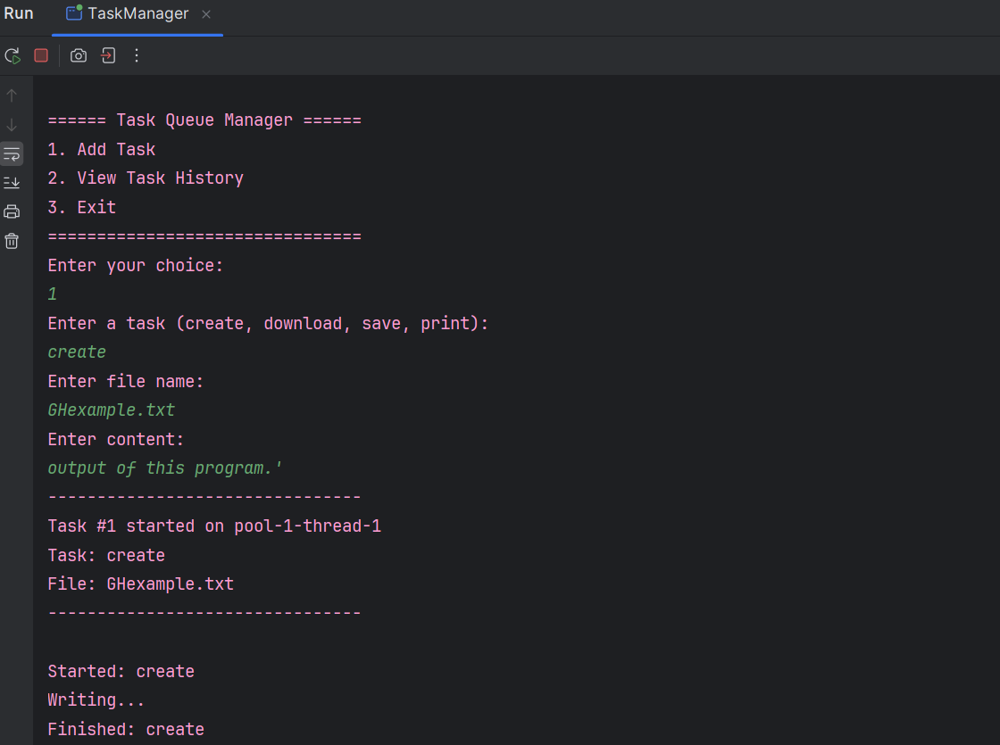
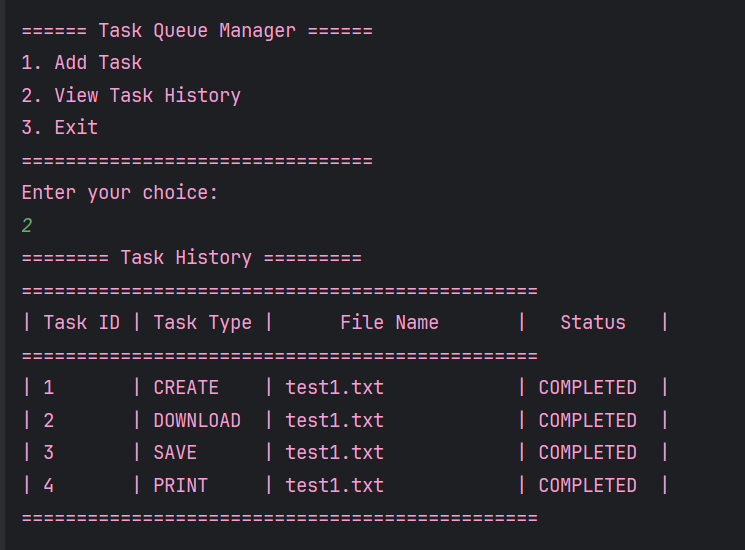

# MULTI-THREADED TASK QUEUE MANAGER 

A Java-based task manager that runs file operations in parallel using fixed thread pool.

### FEATURES
* Runs tasks like create, save, print, and download.
* Uses ExecutorService with multithreading.
* Thread-safe task logs using ConcurrentLinkedQueue.

### TECHNOLOGIES USED
- Java 17
- ExecutorService
- BufferedReader / BufferedWriter
- AtomicInteger

### HOW TO RUN
   javac TaskManager.java 
   java TaskManager

# OUTPUT IMAGES

